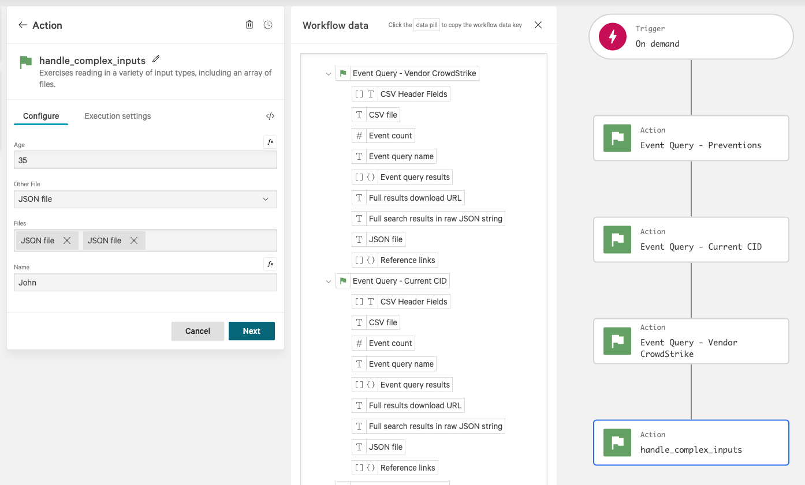

# Complex Inputs with Multiple Files

In this example, we see how to author a Foundry Function authored in Python which can accept a JSON payload and a
collection of files as input.
The files are provided in two ways. The first is as an array and the second is as an individual field.
The files are read in full and then concatenated and returned.
JSON schemas are provided which show how to integrate successfully with Fusion.

### Fusion Workflow

